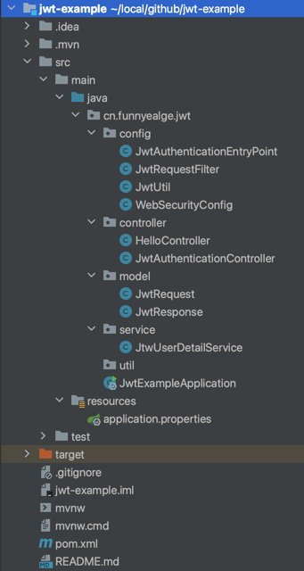

# JWT Example

这是一个关于如何使用`JWT`的入门项目，JWT简介可以参考[JWT介绍](http://www.funnyeagle.cn/Introduction-to-jwt/) 。
项目基于`jdk8`, ` `spring-boot`, `spring-security`, `jjwt` 搭建。

## 一、项目结构



```text
└── jwt
    ├── JwtExampleApplication.java            // 启动类
    ├── config
    │   ├── JwtAuthenticationEntryPoint.java  // 继承Spring的AuthenticationEntryPoint类，拒绝未经身份验证的请求并返回401
    │   ├── JwtRequestFilter.java             // 继承自Spring的OncePerRequestFilter，每个请求都会执行此过滤器，用于检查Token有效性
    │   ├── JwtUtil.java                      // 生成和验证Token，从Token中获取信息
    │   └── WebSecurityConfig.java            // 
    ├── controller
    │   ├── HelloController.java              // 测试接口
    │   └── JwtAuthenticationController.java  // 获取token接口
    ├── model
    │   ├── JwtRequest.java                   // JWT请求 
    │   └── JwtResponse.java                  // JWT响应
    ├── service
        └── JtwUserDetailService.java         // 实现spring 的 UserDetailsService接口，通过username查询用户实体
    

```

## 二、功能

1. 调用 `/authenticate` 接口，获取token
2. 调用 `/hello` 接口，需要携带token，否则返回401

## 三、运行

运行启动类 `JwtExampleApplication.java` ，默认端口为8080

```
// POST 请求 获取token
http://localhost:8080/authenticate

// Body
{
   "username": "funnyeagle",
   "password": "funnyeagle"
}

// GET 请求访问接口
http://localhost:8080/hello

在Header 中添加 JWT token
key: Authorization
value: Bearer xxxx.xxxxx.xxxxxx
```

